Awesome outliner is an outliner app. All data is stored locally.

Now only provide the Chinese version. The English version will be provided in the next release. So the remaining part of the document will be written in Chinese. The English document and app will be provided in the next release.

这个仓库提供Awesome outliner 安装包的下载地址，https://github.com/awehook/awesome-outliner-package/releases

# 简介

Awesome outliner 是一款大纲笔记app,所有的数据都保存在本地。由于软件尚处于开发中，不保证后续版本的数据格式兼容现在的版本。

Awesome outliner 的构建过程中主要使用了以下开源库：[electron](https://github.com/electron/electron),[react](https://github.com/facebook/react),[draft.js](https://github.com/facebook/draft-js),[immutable.js](https://github.com/immutable-js/immutable-js),[pouchdb](https://github.com/pouchdb/pouchdb)

软件的主界面如下:
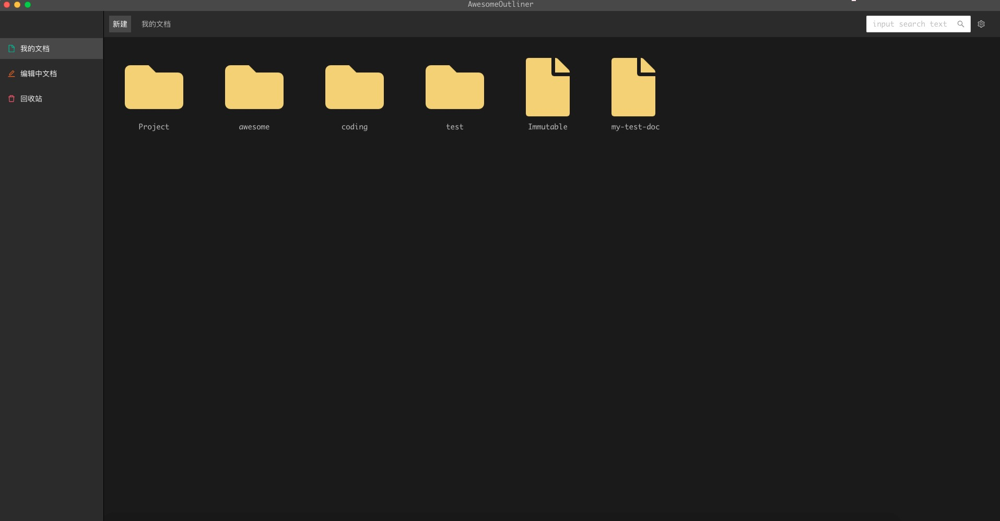
其中我的文档选项卡显示用户创建的所有文件和文件夹。

编辑中文档选项卡显示用户正在编辑的文档

回收站选项卡显示用户的回收站，回收站里面的内容可以被恢复或者彻底删除。

# 使用说明

## 设置

在软件第一次启动的时候，会有界面提示让用户选择数据的保存位置。选择一个电脑上的目录，之后所有的文档数据都以二进制格式存储在这个目录中。

**如果在选择了数据存储目录之后没有进入主界面,可以点菜单 view-> force reload**

在使用过程中也可以通过菜单->Preferences 打开首选项界面，设置数据存储目录和主题。

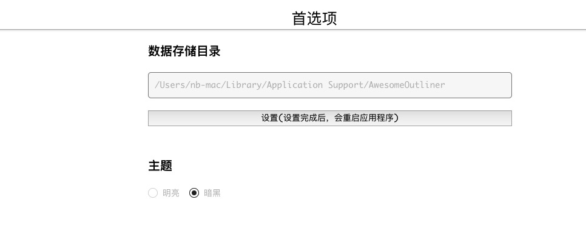

主题目前只支持两种主题，明亮和暗黑，默认是暗黑模式。
明亮模式的编辑器效果如下：

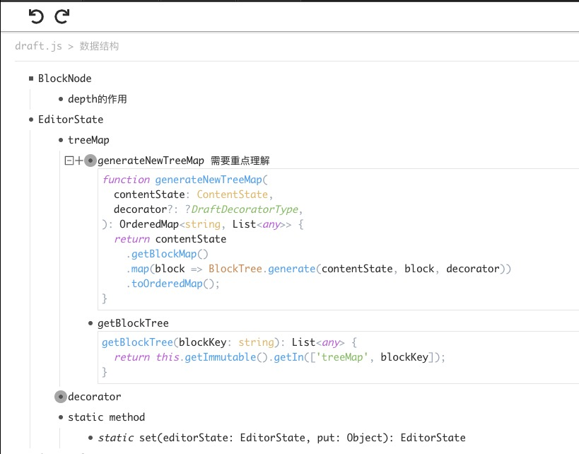

## 创建文档
在我的文档界面中点击新建按钮，弹出新建文件和新建文件夹菜单。

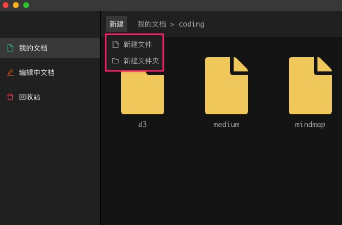

点击新建文件按钮创建一个新的文档，点击新建文件夹按钮则创建一个新的文件夹。

多层文件夹嵌套可以通过上方的文件夹导航栏进行跳转。

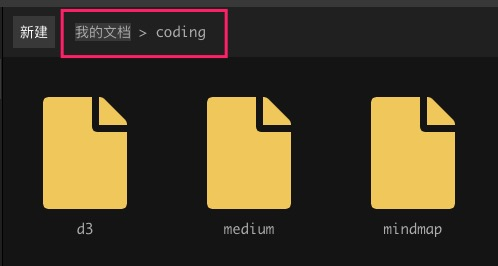

光标移到文档图标上时文档会高亮，点击之后会打开文档

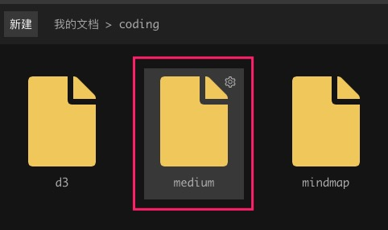

## 文档管理
光标移到文档或者文件夹图标上时会高亮，并且在右上角还会出现一个齿轮状按钮，点击这个按钮会弹出菜单，可以对文档进行重命名，移动和删除操作。目前移动到功能尚未开发。

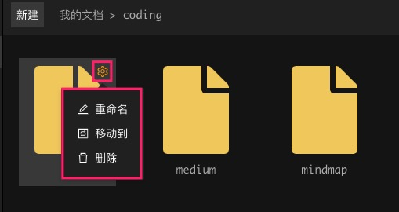

点击删除按钮会弹出对话框

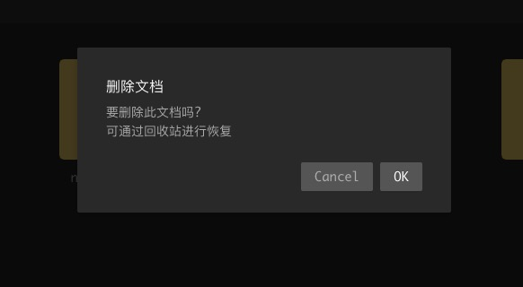

## 文档编辑
打开文档之后会自动跳转到编辑中文档选项卡，所有正在编辑中的文档都会以tab页的方式显示在其中。

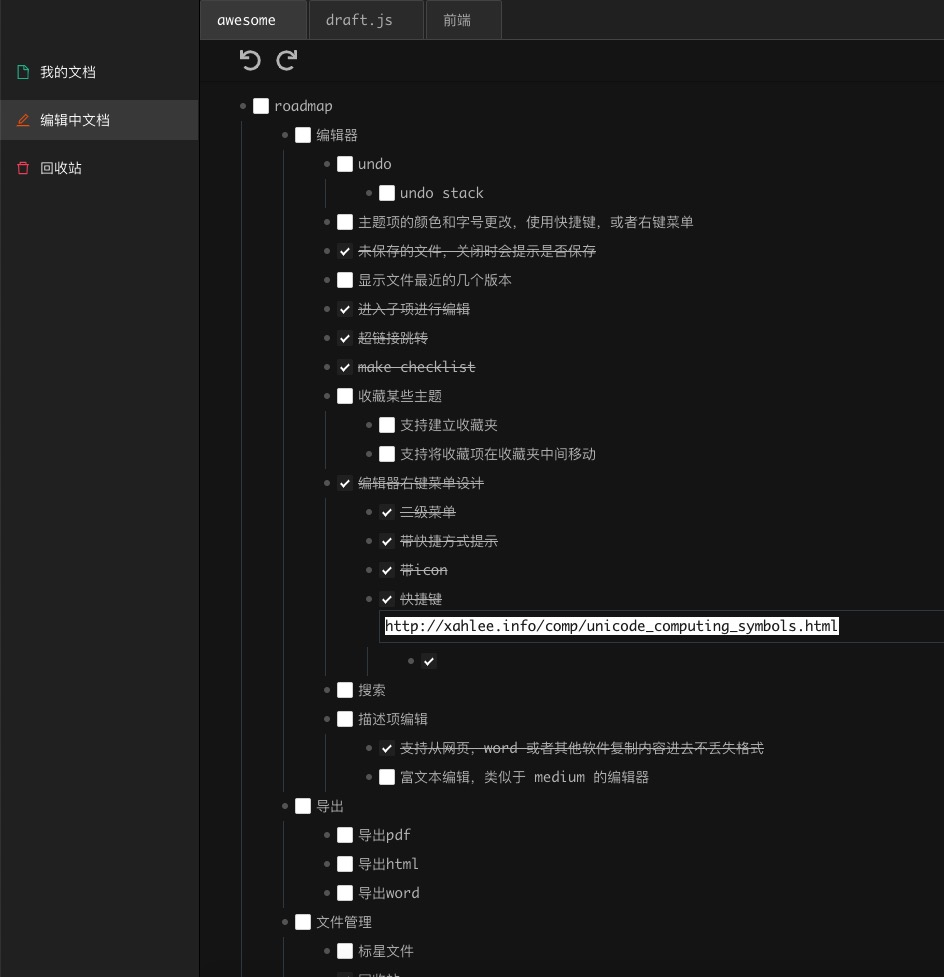

按住鼠标并拖动文档的标题栏，将会将这个文档脱离原来的主界面，新开的窗口进行编辑。

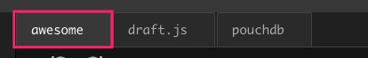

新窗口如下：

### 编辑器内部操作
与[workflow](https://workflowy.com/) 非常类似。
在某个条目下按enter 键新建一个兄弟节点。按tab 键将当前项变成其上面的兄弟节点的子节点。按shift+tab 键将当前项变成其父节点的兄弟节点。

#### 编辑描述项

在某个条目下右键弹出右键菜单，可以进行编辑描述操作。

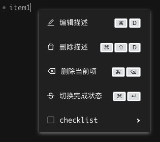

在编辑描述时可以从网页复制内容直接粘贴进去。编辑器会进行排版，文字的图片都会以很好的格式保存。

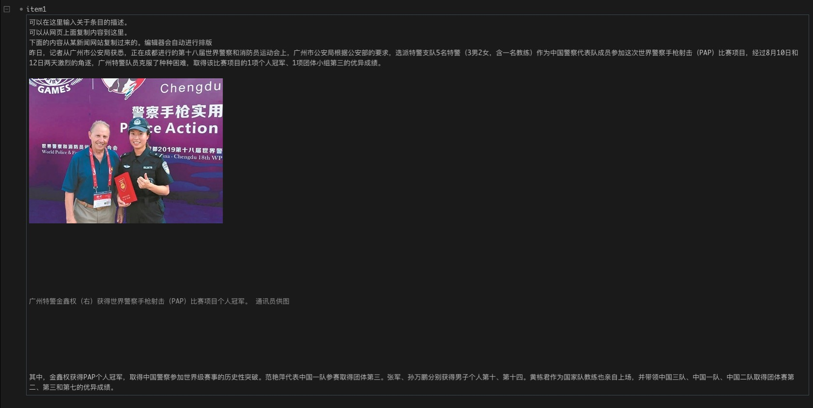

可以直接粘贴截图软件的截图到这里，在截图软件里面把截图保存在剪切板，然后在这里按Ctrl + V 或者 Command + V 进行粘贴。

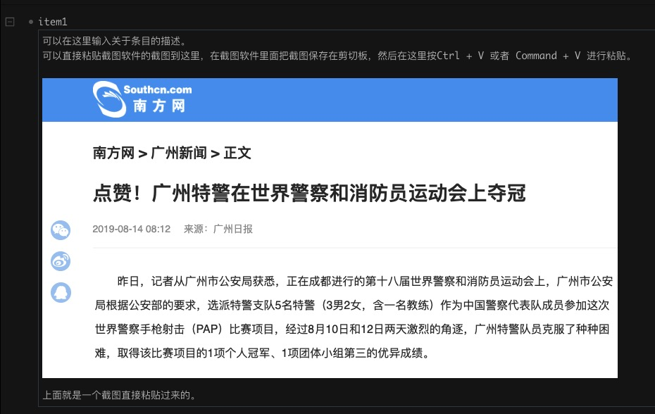

可以在IDE 里面直接复制粘贴代码到这里。

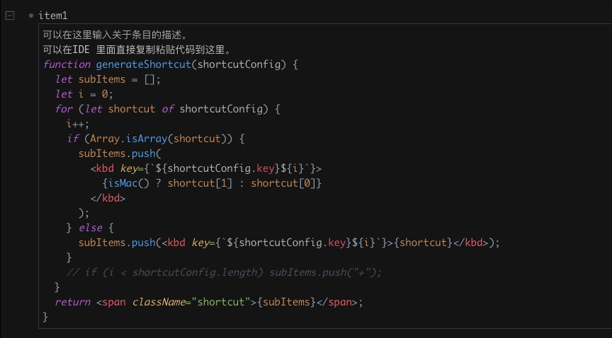

#### todolist/checklist 功能

可以通过右键或者快捷方式来切换当前条目为todolist,以及切换它们的完成状态。

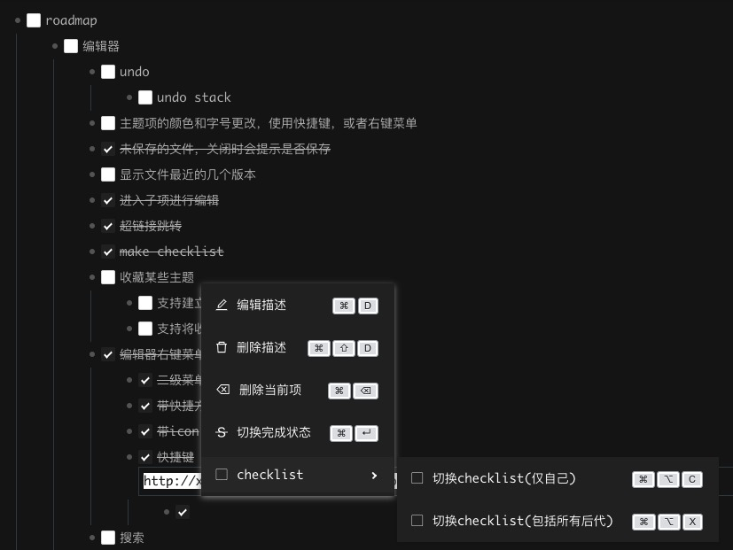

#### 折叠功能

当光标移动到某个条目时，会出现折叠和取消折叠的icon

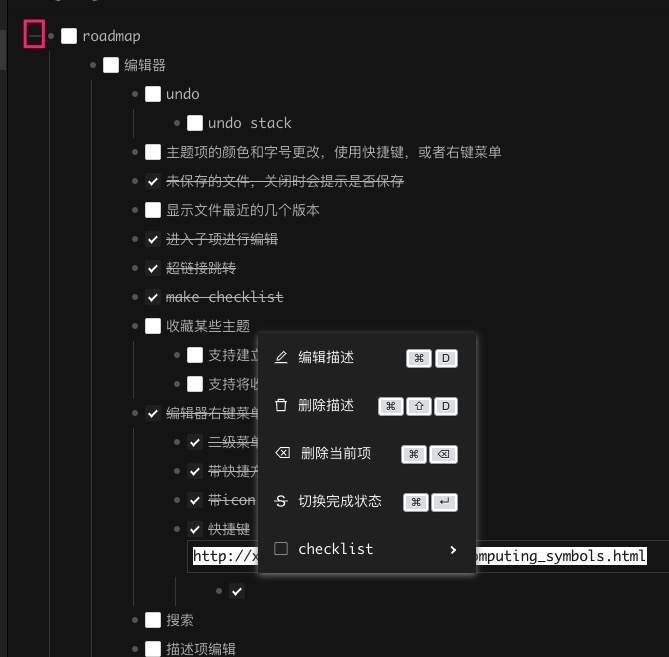

对于有描述的条目，光标移动上去时，会出现折叠描述的icon,对于既有描述又有子项的条目，则两个折叠icon 都会出现。

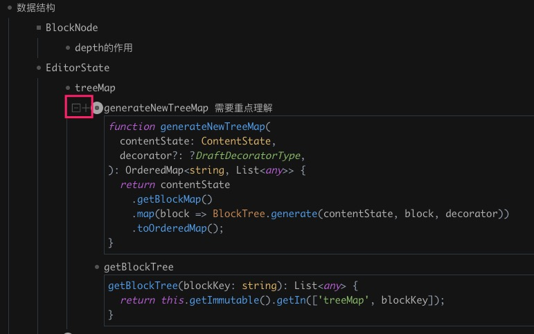

这里面有一些icon 形状随着折叠和是否有描述等状态的改变，在此不细说了。

#### 条目导航

当一个文档中条目很多时，可以进入任何条目内部进行编辑。

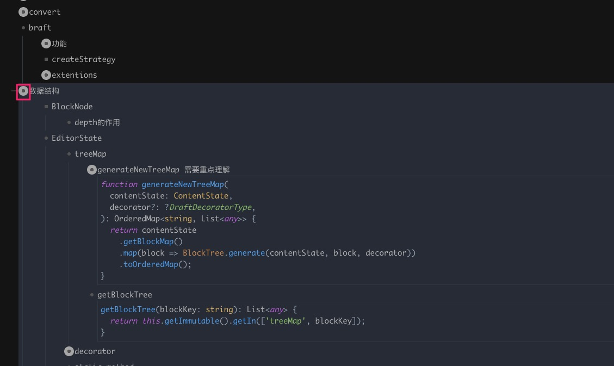

点击条目坐标的icon进入条目内部进行编辑

当进入条目内部时，文档编辑区域的上方会出现条目导航栏，可以在此进入任何上层条目。

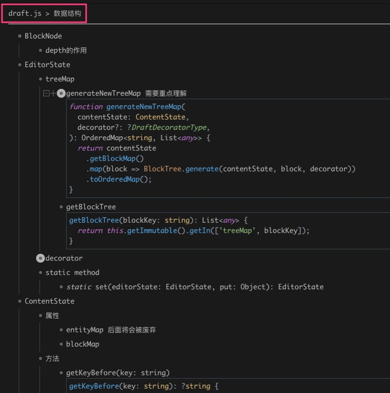

## 出现在界面中但是未完成的功能

1. 文档和文件夹的移动操作
2. 文件内容搜索
3. 撤销和重做（描述项编辑的撤销和重做有，但是整体上操作条目的撤销和重做暂时没有）

# 后续规划（roadmap）

以下并不是按照优先级来列举

1. 文档和文件夹的移动操作
2. 文件内容搜索
3. 撤销和重做（描述项编辑的撤销和重做有，但是整体上操作条目的撤销和重做暂时没有）
4. 描述项的富文本编辑器(类似于medium)
5. 以思维导图形式查看和编辑文档 (关于这部分的探索新开了一个开源仓库https://github.com/awehook/blink-mind-react)
6. 数据和网盘数据进行同步(dropbox 或者其他网盘)
